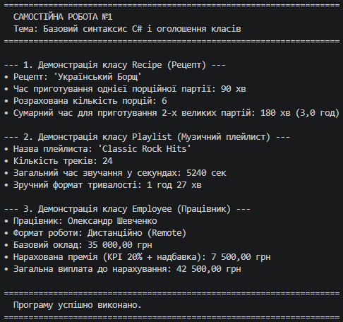

### Звіт з Самостійної роботи №1

- **Репозиторій GitHub:** https://github.com/YourUsername/IndependentWork1
- **Короткий опис створених класів:**
  - `Recipe` — описує кулінарний рецепт, розраховує час приготування декількох партій.
  - `Playlist` — описує музичний плейлист, форматує сумарну тривалість треків із секунд у години та хвилини.
  - `Employee` — описує працівника компанії, обчислює підсумкову премію з урахуванням KPI та формою роботи.
- **Висновок:** У ході виконання самостійної роботи було закріплено навички створення класів у C#, оголошення приватних полів, використання властивостей (зокрема read-only), застосування конструкторів та реалізації методів із власною логікою.

