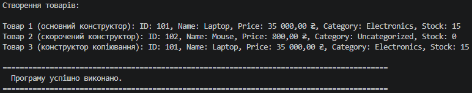

### Звіт з Самостійної роботи №2

- **Репозиторій GitHub:** https://github.com/YourUsername/IndependentWork2
- **Короткий опис виконання:**
  - Реалізовано клас `Product` із 5 read-only властивостями.
  - Реалізовано 3 перевантажені конструктори із зв'язуванням через `: this(...)`.
  - Перевизначено метод `ToString()` для автоматичного форматування ціни та інформації про товар.
  - У `Program.cs` продемонстровано роботу всіх трьох конструкторів.
- **Висновок:** У ході виконання роботи закріплено практичні навички перевантаження конструкторів у C#, використання каскадного виклику конструкторів через `this(...)` та створення незмінних (immutable) класів.

