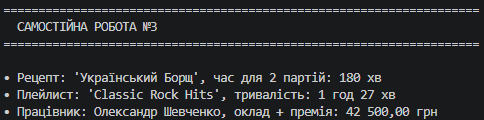

## Висновок

У ході виконання **Самостійної роботи №3** було проведено детальний аналіз застосування принципів інкапсуляції та валідації в реальному open-source проєкті **Newtonsoft.Json**:

1. **Аналіз інкапсуляції:** На прикладі класів `JProperty`, `JValue` та `JObject` досліджено використання приватних полів (`private readonly`), read-only властивостей, а також індексаторів і перевантажених операторів для створення зручного API.
2. **Практики валідації:** З'ясовано, що в професійному коді застосовується підхід **Guard Clauses** (перевірки на початку методів через `ValidationUtils`) та викидання стандартних винятків (`ArgumentNullException`). Це забезпечує виявлення помилок на найранніших етапах (Fail-Fast).
3. **Підсумок:** Дослідження підтвердило, що сувора інкапсуляція та вчасна валідація входження даних є запорукою надійності, безпеки та легкості підтримки складних програмних продуктів.

