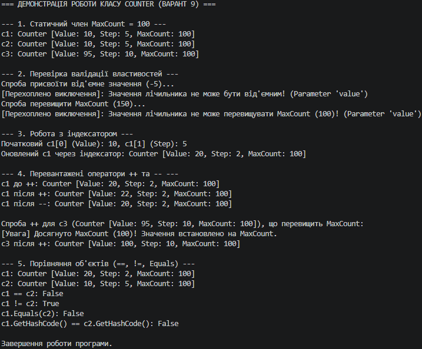

### Висновок

У ході виконання лабораторної роботи №4 було опановано практичні навички роботи з властивостями, статичними членами, індексаторами та перевантаженням операторів у мові C#.

1. **Інкапсуляція та валідація:** Реалізовано клас `Counter`, де приватні поля захищені публічними властивостями з валідацією. Це гарантує цілісність даних об'єкта (неможливість присвоєння від'ємних значень чи перевищення допустимого ліміту).
2. **Статичні члени:** Використано статичну властивість `MaxCount`, яка задає спільне для всіх екземплярів класу обмеження верхньої межі обчислень.
3. **Індексатори:** Реалізовано індексатор `this[int index]`, який надає зручний доступ до полів об'єкта за індексом.
4. **Перевантаження операторів:** Перевантажено унарні оператори `++` та `--` для лаконічної зміни стану лічильника, а також бінарні оператори `==` і `!=`. Разом із цим було перевизначено методи `Equals()`, `GetHashCode()` та `ToString()` для забезпечення узгодженої поведінки при порівнянні та форматованому виводі.

Отримані знання дозволяють створювати гнучкі, безпечні та інтуїтивно зрозумілі інтерфейси класів у .NET.

