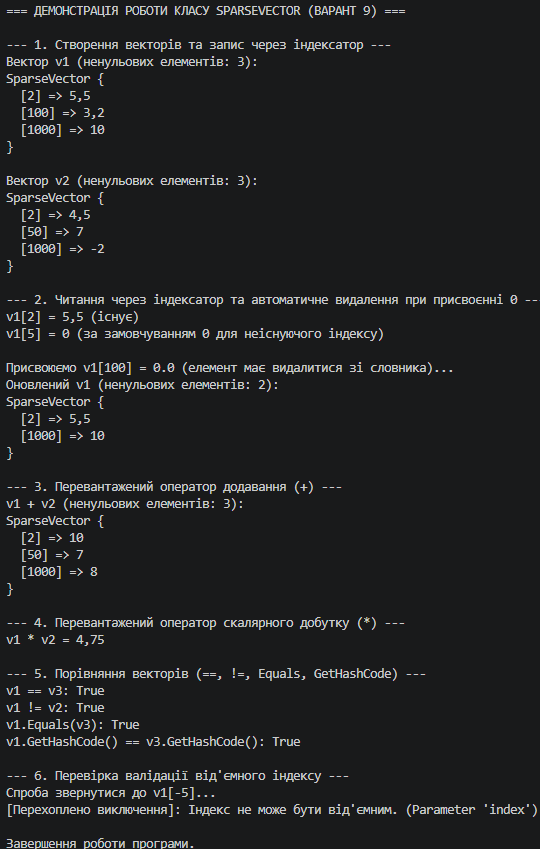

### Висновок

У ході виконання лабораторної роботи №5 було успішно опановано практичні навички створення індексаторів та перевантаження операторів у мові C#.

1. **Реалізація індексаторів:** На прикладі класу `SparseVector` створено індексатор `this[int index]`, який забезпечує зручний доступ до елементів за індексом. Завдяки реалізованій логіці, вектор зберігає у внутрішньому словнику `Dictionary<int, double>` лише ненульові значення, що дає змогу ефективно працювати з вектором великої розмірності без зайвих витрат пам'яті.
2. **Перевантаження операторів:** Реалізовано оператор додавання `+` для додавання векторів, оператор множення `*` для обчислення скалярного добутку, а також пару операторів порівняння `==` та `!=`.
3. **Забезпечення цілісності:** Для коректної роботи порівнянь та хешь-колекцій було перевизначено стандартні методи `ToString()`, `Equals()` та `GetHashCode()`.

Отримані знання дозволяють створювати виразні, читабельні та ефективні структурні типи даних у середовищі .NET.

