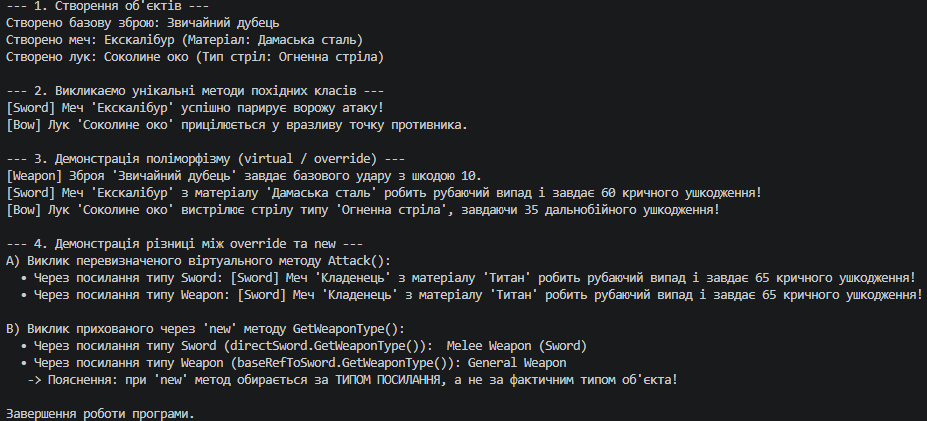

### Висновок

У ході виконання лабораторної роботи №6 було опановано практичні навички побудови ієрархії класів у C# з використанням механізмів наслідування та поліморфізму.

1. **Побудова ієрархії та `base`:** Створено базовий клас `Weapon` та похідні класи `Sword` і `Bow`. За допомогою конструкції `base(...)` забезпечено коректну передачу параметрів до конструктора базового класу.
2. **Динамічний поліморфізм (`virtual` / `override`):** Реалізовано віртуальний метод `Attack()` у базовому класі та його динамічне перевизначення у похідних класах. Демонстрація у списку `List<Weapon>` підтвердила, що при роботі через базове посилання викликається реалізація фактичного об'єкта.
3. **Статичне приховування членів (`new`):** Продемонстровано різницю між `override` та `new` на прикладі методу `GetWeaponType()`. При виклику прихованого через `new` методу вирішальним є тип посилання (раннє зв'язування), тоді як при `override` — фактичний тип об'єкта (пізнє зв'язування).

Отримані знання дозволяють будувати гнучкі та розширювані програмні архітектури з використанням ООП у середовищі .NET.

