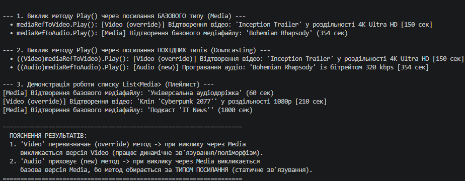

### Звіт з лабораторної роботи №7

- **Репозиторій GitHub:** https://github.com/YourUsername/OOP-Shevchenko (проєкт lab7v9)
- **Короткий опис класів:**
  - `Media` — базовий клас з віртуальним методом `Play()`.
  - `Video` (похідний клас A) — перевизначає метод `Play()` за допомогою `override`, розширюючи властивістю `Resolution`.
  - `Audio` (похідний клас B) — приховує метод `Play()` за допомогою `new`, додаючи властивість `BitrateKbps`.
- **Висновок:** У ході виконання роботи було практично досліджено відмінність між поліморфним перевизначенням (`override`) та статичним приховуванням (`new`). Продемонстровано, що при використанні `override` поведінка об'єкта визначається його реальним типом у пам'яті, а при `new` — типом посилання.

