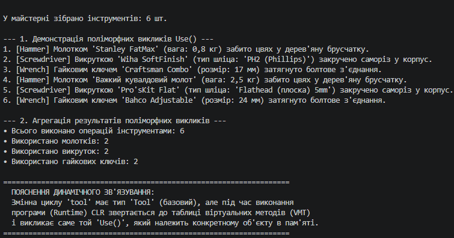

### Звіт з лабораторної роботи №8

- **Репозиторій GitHub:** https://github.com/YourUsername/OOP-Shevchenko (проєкт lab8v9)
- **Короткий опис ієрархії:**
  - `Tool` — базовий клас із властивістю `Name` та віртуальним методом `Use()`.
  - `Hammer` — похідний клас з додатковою властивістю `Weight` (вага), перевизначає `Use()`.
  - `Screwdriver` — похідний клас з додатковою властивістю `TipType` (тип шліца), перевизначає `Use()`.
  - `Wrench` — похідний клас з додатковою властивістю `Size` (розмір), перевизначає `Use()`.
- **Результати агрегації:** Програмою сформовано колекцію інструментів `List<Tool>`, успішно виконано циклічний виклик `Use()` та збережено підсумковий журнал дій і статистику використання кожного типу інструмента.
- **Висновок:** У ході виконання лабораторної роботи №8 засвоєно механізми динамічного зв'язування та перевизначення методів, а також практично доведено переваги використання поліморфних колекцій базових типів.

